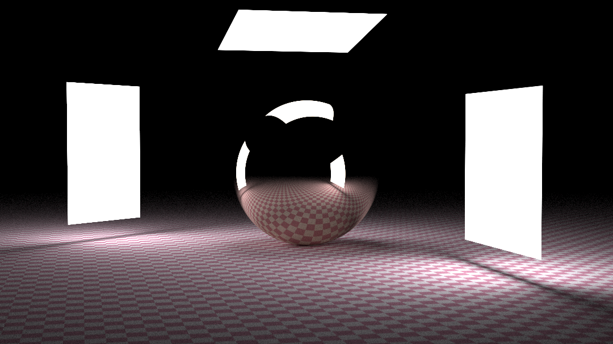
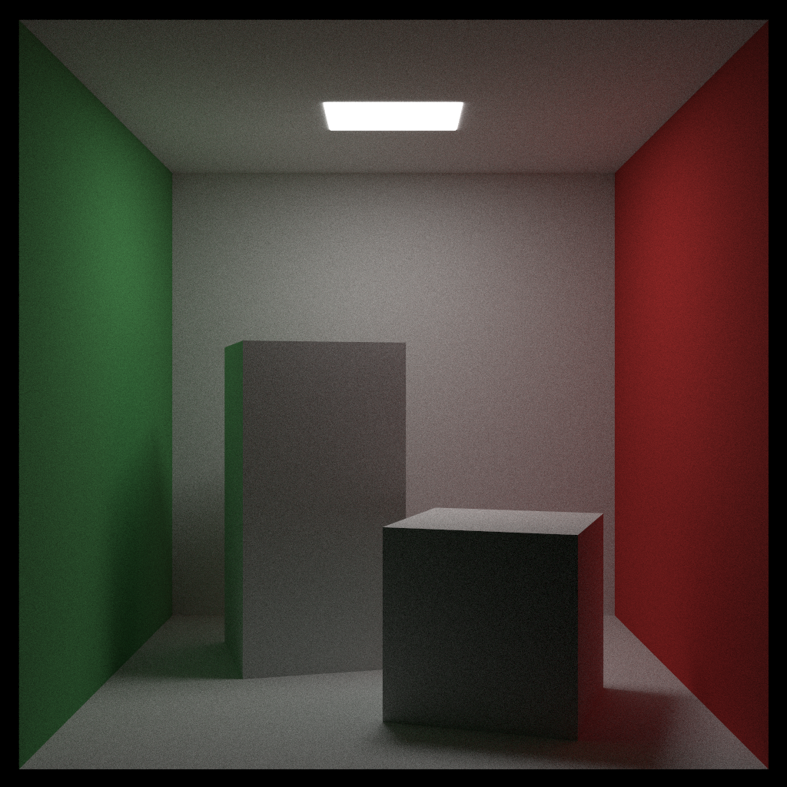
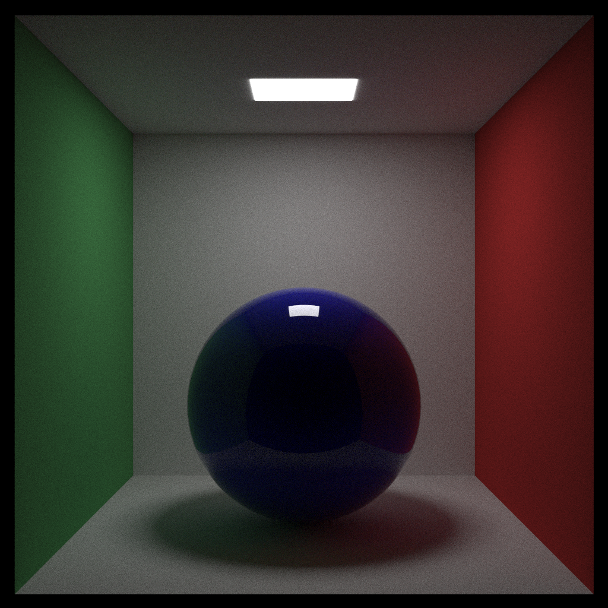
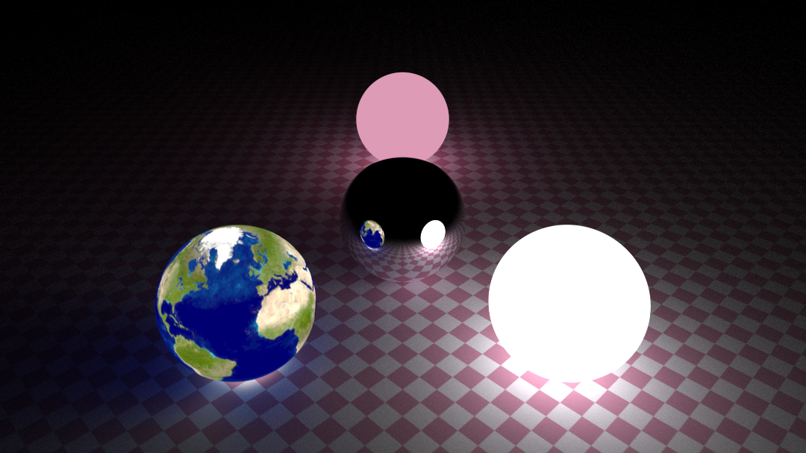

# raytracing.rs

An implementation of [_Ray Tracing in One Weekend_](https://raytracing.github.io/books/RayTracingInOneWeekend.html) and [_Ray Tracing: The Next Week_](https://raytracing.github.io/books/RayTracingTheNextWeek.html) in 2.1 kLoC of Rust.

## Features
- **Basic** textures, materials, objects and transformations
- **Simple** BVH for object organization
- **Naive** one-line pixel-level parallelism
- **Trivial** macro- and generic-based static dispatches
- **Childish** interactive GUI (see `interactive` branch)

## Gallery
- Weekend Final
    
- Rectangle Light
    
- Cornell Box
    
- Smoke Sphere in Cornell Box
    
- Checker
    

## Roadmap
- [ ] SIMD support
- [ ] PDF support
